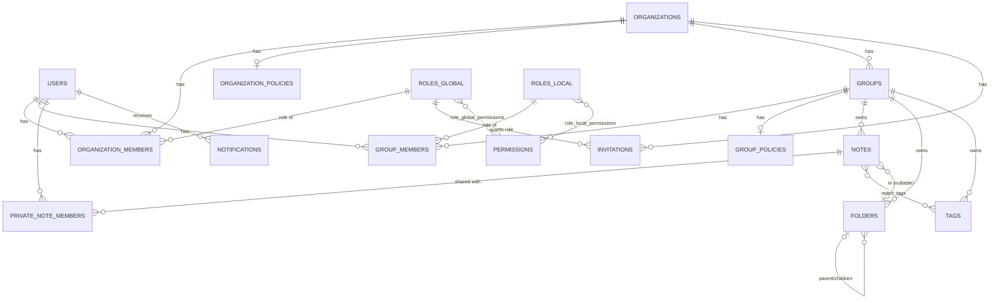
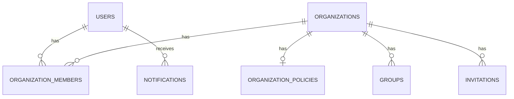
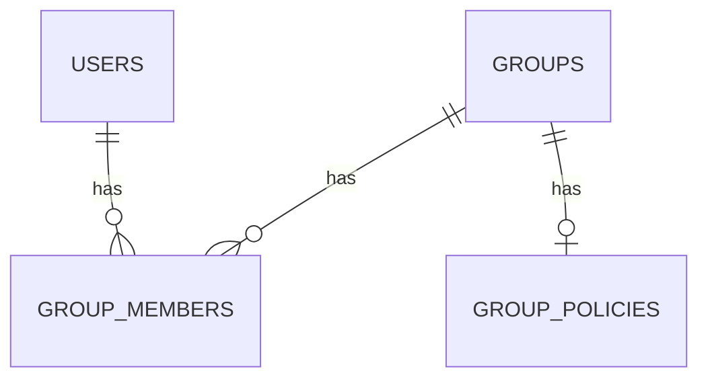
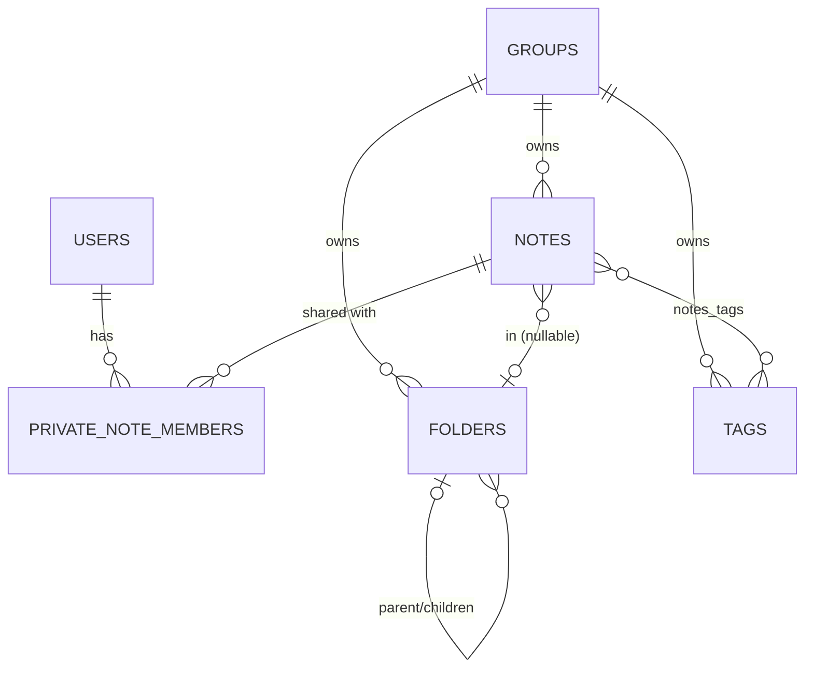
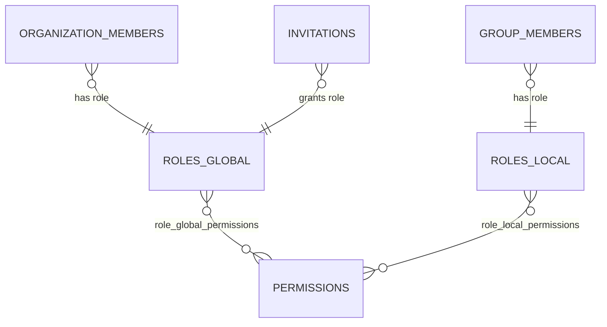
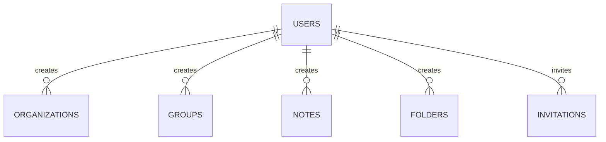

# データベース設計

SQLAlchemy 2.0 の `Mapped` / `mapped_column` スタイルで定義されている（`backend/app/model/`）。本ドキュメントのカラム定義はモデルコードから直接書き起こしたもの。マイグレーションは Alembic（`backend/migrations/`）で管理する。

## ER図

関係線の密集を避けるため、テーマごとに4枚に分けている。`GROUPS` / `NOTES` など複数の図にまたがるテーブルは、それぞれの図で見やすくするために重複して記載している。

### 記法の読み方

Mermaid の `erDiagram` は「鳥の足記法（crow's foot notation）」で書かれている。線の両端の記号がそれぞれの側の**多重度（何件あり得るか）**を表す。

| 記号 | 意味 |
|------|------|
| `\|\|` | ちょうど1件（必須） |
| `o\|` | 0件または1件（任意） |
| `}o` | 0件以上（任意・多数） |
| `}\|` | 1件以上（必須・多数） |

例えば `ORGANIZATIONS \|\|--o{ GROUPS : has` は「1つの組織（`\|\|`＝ちょうど1）に対して、グループは0件以上（`o{`）」、つまり組織1件に対してグループが複数ぶら下がる1対多の関係を表す。`ROLES_GLOBAL }o--o{ PERMISSIONS` のように両端が `}o` になっている場合は多対多の関係（間に中間テーブルがある）を表す。ラベル（`: has` の部分）は関係の意味を補足するコメント。

### 全体像

以下は全テーブルを1枚にまとめたもの。線が密集していて読みにくい部分があるので、詳細を追うときはこの下のテーマ別の図を参照。

### 組織構造

### グループとメンバー

### ノート・フォルダー・タグ

### RBAC（ロール・権限）

`ORGANIZATION_MEMBERS` / `GROUP_MEMBERS` / `INVITATIONS` は上の図にも登場するテーブルだが、ロールとの関係を見やすくするためこちらにも重複して記載している。

### 作成者関係

「誰がこのレコードを作成したか」を表す `created_by_user_id` / `invited_by_user_id` のFKをまとめたもの（全体像・テーマ別図では省略していたもの）。

## テーブル定義

### users

| カラム | 型 | 制約 |
|--------|-----|------|
| id | Integer | PK |
| username | String(100) | unique, not null |
| email | String(120) | unique, not null |
| password_hash | String(255) | not null |
| verified | Boolean | default false |
| reset_token_hash | String(64) | nullable |
| pending_email | String(120) | nullable（メールアドレス変更申請中の新アドレス） |
| created_at | DateTime(tz) | default now (UTC) |

### organizations

| カラム | 型 | 制約 |
|--------|-----|------|
| id | Integer | PK |
| name | String(200) | not null |
| created_at | DateTime(tz) | default now |
| created_by_user_id | Integer | FK → users.id |

`cascade="all, delete-orphan"` で `members` / `policy` / `groups` を保持。組織削除時に連動して削除される（ただしAPI層では既存グループがある場合は削除自体をブロックする運用）。

### organization_members

組織とユーザーの中間テーブル。**複合PK** (`user_id`, `organization_id`)。

| カラム | 型 | 制約 |
|--------|-----|------|
| user_id | Integer | PK, FK → users.id |
| organization_id | Integer | PK, FK → organizations.id |
| role_id | Integer | FK → roles_global.id, not null |
| joined_at | DateTime(tz) | default now |

### organization_policies

組織と1:1。

| カラム | 型 | 制約 |
|--------|-----|------|
| id | Integer | PK |
| organization_id | Integer | FK → organizations.id, unique |
| allow_private_groups | Boolean | default true |
| allow_private_notes | Boolean | default true |
| who_can_create_groups | String(50) | default `"member"`（`sys_admin_only` \| `user_admin` \| `member` \| `all`） |
| default_join_method | String(50) | default `"invite_only"`（`invite_only` \| `request` \| `open`） |

### groups

| カラム | 型 | 制約 |
|--------|-----|------|
| id | Integer | PK |
| organization_id | Integer | FK → organizations.id, not null |
| name | String(200) | not null |
| is_private | Boolean | default false |
| created_at | DateTime(tz) | default now |
| created_by_user_id | Integer | FK → users.id |

`cascade="all, delete-orphan"` で `members` / `policy` / `notes` / `folders` / `tags` を保持。グループ削除時に連動削除される。

### group_members

グループとユーザーの中間テーブル。**複合PK** (`user_id`, `group_id`)。

| カラム | 型 | 制約 |
|--------|-----|------|
| user_id | Integer | PK, FK → users.id |
| group_id | Integer | PK, FK → groups.id |
| role_id | Integer | FK → roles_local.id, not null |
| joined_at | DateTime(tz) | default now |
| status | String(20) | default `"active"`（`active` \| `pending` \| `rejected`） |
| approved_at | DateTime(tz) | nullable（申請フロー経由の承認時のみセット） |
| rejected_at | DateTime(tz) | nullable（拒否通知を届けるまで保持） |

### group_policies

グループと1:1。

| カラム | 型 | 制約 |
|--------|-----|------|
| id | Integer | PK |
| group_id | Integer | FK → groups.id, unique |
| allow_private_notes | Boolean | default true |
| join_method | String(50) | default `"invite_only"`（`invite_only` \| `request` \| `open`） |
| is_notes_visible_to_org | Boolean | default false |

### notes

| カラム | 型 | 制約 |
|--------|-----|------|
| id | Integer | PK |
| group_id | Integer | FK → groups.id, not null |
| created_by_user_id | Integer | FK → users.id, not null |
| title | String(200) | not null |
| content_md | Text | not null |
| is_private | Boolean | default false |
| folder_id | Integer | FK → folders.id, nullable |
| created_at | DateTime | default now (JST), index |
| updated_at | DateTime | default/onupdate now (JST), index |

`tags` は `notes_tags` 中間テーブル経由の多対多。`private_members`（`PrivateNoteMember`）は `is_private=True` のときのみ使用され、`cascade="all, delete-orphan"`。

### private_note_members

非公開ノートの共有メンバーテーブル。**複合PK** (`note_id`, `user_id`)。作成者は `role="owner"` として自動登録される。

| カラム | 型 | 制約 |
|--------|-----|------|
| note_id | Integer | PK, FK → notes.id, `ondelete="CASCADE"` |
| user_id | Integer | PK, FK → users.id |
| role | String(20) | not null（`owner` \| `editor` \| `viewer`） |
| invited_at | DateTime | default now (JST) |

### tags

| カラム | 型 | 制約 |
|--------|-----|------|
| id | Integer | PK |
| group_id | Integer | FK → groups.id, not null |
| tagname | String(20) | not null |

`UniqueConstraint(group_id, tagname)` — 同一グループ内でのタグ名重複を防止。`notes_tags` は `note_id` / `tag_id` の複合PKを持つ多対多中間テーブル。

### folders

| カラム | 型 | 制約 |
|--------|-----|------|
| id | Integer | PK |
| group_id | Integer | FK → groups.id, not null |
| created_by_user_id | Integer | FK → users.id, not null |
| parent_id | Integer | FK → folders.id, nullable（自己参照） |
| name | String(100) | not null |

`children` は `cascade="all, delete-orphan"`（親フォルダー削除で子フォルダーも削除）。`notes` は `cascade="all, delete"`（フォルダー削除でその直下のノートも削除。ノートは事前に別フォルダーへ移動しておく必要がある）。

### permissions

| カラム | 型 | 制約 |
|--------|-----|------|
| id | Integer | PK |
| code | String(100) | unique, not null（例: `org:edit`, `note:read`） |
| description | String(500) | nullable |

### roles_global

組織レベルのロール定義（`owner` / `sys_admin` / `user_admin` / `member`）。`permissions` は `role_global_permissions` 中間テーブル経由で多対多。

| カラム | 型 | 制約 |
|--------|-----|------|
| id | Integer | PK |
| name | String(100) | unique, not null |
| description | String(500) | nullable |

### roles_local

グループレベルのロール定義（`admin` / `editor` / `viewer`）。`permissions` は `role_local_permissions` 中間テーブル経由で多対多。カラム構成は `roles_global` と同じ。

### invitations

組織へのメール招待。

| カラム | 型 | 制約 |
|--------|-----|------|
| id | Integer | PK |
| token | String(36) | unique, not null（UUID） |
| email | String(254) | not null |
| organization_id | Integer | FK → organizations.id, `ondelete="CASCADE"` |
| invited_by_user_id | Integer | FK → users.id, `ondelete="CASCADE"` |
| role_id | Integer | FK → roles_global.id（承認後に付与するロール） |
| status | String(20) | default `"pending"`（`pending` \| `accepted` \| `expired`） |
| created_at | DateTime(tz) | default now |
| expires_at | DateTime(tz) | default now + 7日 |

### notifications

アプリ内通知（参加申請の承認/却下など）。

| カラム | 型 | 制約 |
|--------|-----|------|
| id | Integer | PK |
| user_id | Integer | FK → users.id, not null |
| message | String(500) | not null |
| link_url | String(500) | nullable |
| is_read | Boolean | default false |
| created_at | DateTime(tz) | default now |

## 主要な制約・カスケードのまとめ

- `organization_members` / `group_members` / `notes_tags` / `private_note_members` は複合主キー（中間テーブル）。
- `tags` は `(group_id, tagname)` でユニーク制約。
- 組織削除 → メンバー・ポリシー・グループを cascade 削除。グループ削除 → メンバー・ポリシー・ノート・フォルダー・タグを cascade 削除。フォルダー削除 → 子フォルダーとその直下のノートを cascade 削除。
- ロールと権限は `Permission` を中心に `role_global_permissions` / `role_local_permissions` の2つの多対多テーブルで束ねられる（RBACの詳細は [domain-model.md](./domain-model.md) を参照）。
