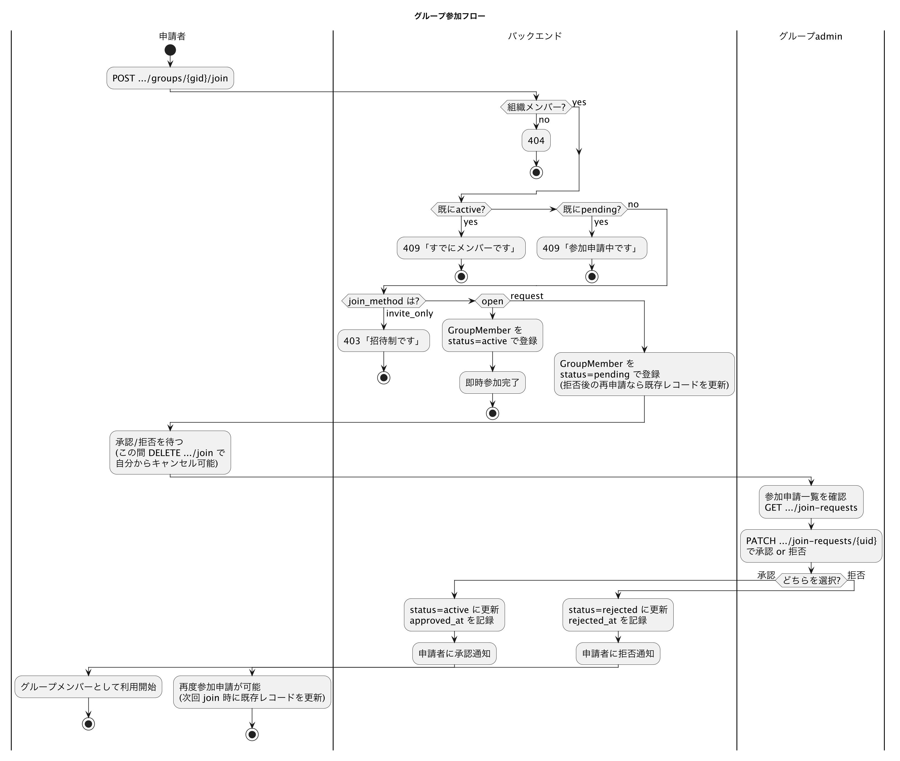

# ドメインモデル

組織／グループ共有機能（Organization & Group Redesign）の中核となる概念を整理する。テーブル定義そのものは [database.md](./database.md) を参照。

## 基本概念

- **Organization（組織）**: 最大の共有単位。ノートは組織の外には一切公開されない。
- **Group（グループ）**: 組織の下位単位。ノートは基本的にグループの中で作成される（例: プロジェクト単位、テーマ単位）。
- **OrganizationPolicy**: 組織ごとの設定（組織と1:1）。誰がグループを作成できるか、デフォルトの参加方式など。
- **GroupPolicy**: グループごとの設定（グループと1:1）。ノートを組織全体に公開するかどうか、参加方式など。
- グループの可視性はデフォルトで組織内に公開。ノートはデフォルトでグループ内に公開。

## ロールと権限（RBAC）

### 組織レベルのロール（`OrganizationMember.role_id → OrganizationRole`）

| ロール | 想定される役割 |
|--------|----------------|
| `owner` | 組織のオーナー（1名。譲渡可能） |
| `sys_admin` | 組織全体の管理（グループ管理含む） |
| `user_admin` | メンバー管理中心 |
| `member` | 一般メンバー |

### グループレベルのロール（`GroupMember.role_id → GroupRole`）

| ロール | 想定される役割 |
|--------|----------------|
| `admin` | グループの管理者 |
| `editor` | ノートの作成・編集が可能 |
| `viewer` | 閲覧のみ |

ロールは `Permission` オブジェクト（`org:edit` のようなコード文字列）の集合として権限を保持する。コードでは `member.role.name` でロール名を、`member.role.has_permission(code)` で権限の有無を判定する。権限チェックのヘルパー関数 `check_org_permission()` / `check_group_permission()` が各サービスファイルに用意されている。

### 権限コード一覧

**組織レベル**: `org:read` / `org:edit` / `org:delete` / `org:member_add` / `org:member_remove` / `org:member_role_assign` / `org:group_create` / `org:group_manage_any`

**グループレベル**: `group:read` / `group:edit` / `group:delete` / `group:member_add` / `group:member_remove` / `group:member_role_assign` / `note:create` / `note:read` / `note:edit` / `note:delete`

RBACのシードデータは `app/model/seed_rbac.py` で投入される。テストでは `conftest.py` が `db.create_all()` 後に `seed_rbac()` を呼ぶ。

## メンバーシップのライフサイクル

`GroupMember.status` は次の3状態を取る。

- `active` — 通常メンバー
- `pending` — 参加申請中（承認待ち）
- `rejected` — 却下された申請

グループの `join_method`（`GroupPolicy` で設定）によって参加フローが変わる。

| join_method | 挙動 |
|-------------|------|
| `open` | 即座に参加（申請不要） |
| `request` | 参加申請 → グループ管理者が承認/却下 |
| `invite_only` | 招待された場合のみ参加可能 |

詳細なフロー（承認・拒否・キャンセル・拒否後の再申請を含む）は以下を参照。

組織への参加は、組織管理者によるメールアドレス指定の招待（`Invitation` モデル、トークンベース）を通じて行われる。招待の状態は `pending` / `accepted` / `expired`。

参加申請の承認・却下は `Notification` モデル経由でアプリ内通知として申請者に届く。

## ノートの公開範囲

- 通常のノートはグループ内のメンバーに公開される（グループの `is_notes_visible_to_org` 設定により、さらに組織全体に公開することも可能）。
- ノートは `is_private` フラグを持ち、非公開ノートは作成者が明示的に共有したメンバーのみ閲覧・編集できる。共有対象は `PrivateNoteMember`（`note_id` + `user_id` の複合キー）で管理し、各メンバーは `owner` / `editor` / `viewer` のいずれかのロールを持つ。
- 非公開ノートを持つメンバーがグループを離脱・削除される際は、そのノートの扱い（所有権の移譲や削除のブロックなど）に注意が必要な運用上の制約がある。詳細は [api-reference.md](./api-reference.md) のグループ離脱/メンバー削除エンドポイントの説明を参照。

## 組織/グループ管理の権限モデル（フロントエンド）

組織admin・グループadminの画面は、権限のないメンバーを完全に締め出すのではなく、`isAdmin` フラグをコンテキスト経由で下位コンポーネントに渡し、メンバー一覧ページだけは非管理者にも読み取り専用 + 自己離脱ボタン付きで表示する設計になっている（管理専用の他ページへは非管理者をリダイレクトする）。
