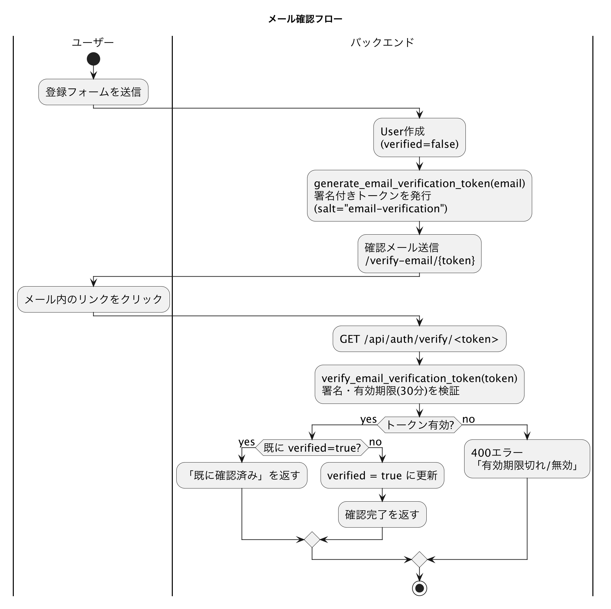
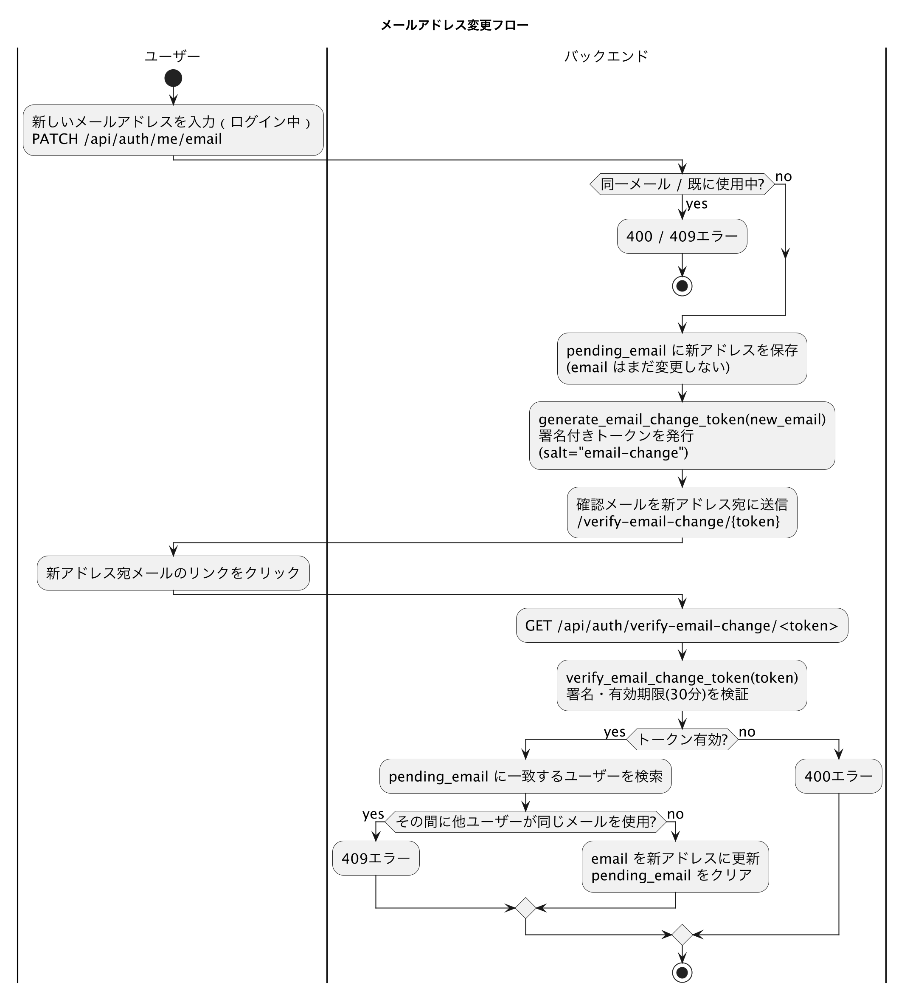
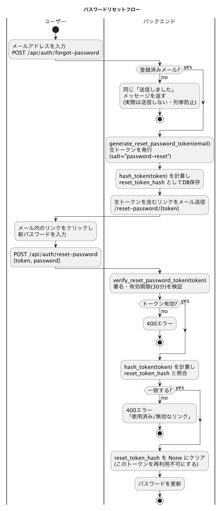

# セキュリティ設計

このアプリで採用しているセキュリティ関連の設計判断をまとめたもの。個別の実装詳細は各ルート・サービスファイルのdocstringや[api-reference.md](./api-reference.md)・[domain-model.md](./domain-model.md)にも断片的に書かれているが、ここでは「なぜその設計にしたか」という観点で横断的に整理する。

## 認証・パスワード

- JWT（Flask-JWT-Extended）によるアクセストークン＋リフレッシュトークン方式。`authFetch`（フロントエンド）がアクセストークンでの401を検知すると自動でリフレッシュを試み、失敗時はログアウトする（[testing.md](./testing.md)の`lib/api.test.ts`参照）
- パスワードは平文保存せず、werkzeugの`generate_password_hash`/`check_password_hash`でハッシュ化して`users.password_hash`に保存
- パスワード変更は2段階（`POST /api/auth/me/password/verify`で現在のパスワードを事前検証 → `PATCH /api/auth/me/password`で変更）

## トークンベースのメールフロー

メール確認・メールアドレス変更・パスワードリセットはすべて`itsdangerous.URLSafeTimedSerializer`による署名付きトークン（`SECRET_KEY`＋用途ごとに異なる`salt`で署名し、有効期限付きで検証）を使う。ただし2種類の設計が混在している。

| フロー | 方式 | 使い回し防止 |
|--------|------|-------------|
| メール確認 / メールアドレス変更 | ステートレスな署名トークンのみ（`salt="email-verification"` / `"email-change"`、期限30分） | なし（期限内は理論上何度でも検証可能。ただし確認済みメールへの再確認は早期returnで無害化） |
| パスワードリセット | 署名トークン**に加えて**、トークンのSHA-256ハッシュを`users.reset_token_hash`にDB保存し、使用後は`None`にクリア | あり（1回使うと同じトークンは再利用不可） |

パスワードリセットだけ二重の仕組み（署名検証 + DB側のワンタイム性）になっているのは、アカウント乗っ取りに直結するリスクが他の2フローより高いための意図的な差別化と考えられる。

各フローの詳細な流れは以下のフローチャートを参照（[PlantUML](https://plantuml.com/ja/activity-diagram-beta)のアクティビティ図。ソース・再生成コマンドは[database.md](./database.md#er図)と同様）。

| フロー | 図 |
|--------|-----|
| メール確認 |  |
| メールアドレス変更 |  |
| パスワードリセット |  |

⚠️ **既知の不整合**: メール確認メールの文面は「有効期限は1時間」と案内しているが（`send_verification_email`）、実際の検証関数`verify_email_verification_token`のデフォルト`expiration`は1800秒（30分）。案内文と実際の期限がズレている。

`POST /api/auth/forgot-password`は、指定されたメールアドレスが未登録の場合でもエラーを返さず、登録済みの場合と同じ「送信しました」という成功メッセージを返す（実際にはメールを送らない）。レスポンス内容の違いから「このメールアドレスは登録されているか」を第三者が探れてしまう（メールアドレス列挙）のを防ぐための設計。

## 招待の悪用防止

`POST /api/invitations/<token>/accept`は、ログイン中のユーザーのメールアドレスと招待先メールアドレスが一致しない場合403を返す。招待リンクを他人が拾って自分のアカウントで承認してしまう（＝意図しないユーザーが組織に入り込む）ことを防いでいる。

## 存在の秘匿（404 vs 403）

「権限がない」ことと「対象が存在する」ことを区別して開示すると、非公開リソースの存在自体が漏れる（enumeration）。このアプリでは以下のルールで統一している。

- **組織の非メンバー**: 組織配下のどのエンドポイントでも常に404（`require_org_member`）。403にすると「組織自体は存在する」と教えてしまうため
- **非公開グループの非メンバー**: 404（`require_group_visible`）。公開グループは組織メンバーであれば誰でも閲覧できるため404にはしない
- **非公開グループの一覧**: `GET .../groups`は`get_accessible_groups`が非メンバーの非公開グループを結果から除外し、そもそもレスポンスに含めない
- **非公開ノートの非対象者**: 404（`get_note_or_404_service`）。作成者・共有メンバー以外には存在自体を返さない
- **ノート/フォルダーAPI共通のアクセスチェック**（`_check_access`ヘルパー）: 組織非メンバーは常に404。権限（`note:read`等）が無い場合は、対象グループが非公開なら404・公開なら403と使い分けている。公開グループの存在自体は既知なので、その場合は「権限が無い」ことを403で正直に伝えても情報漏洩にならないという判断

## 非公開ノートの細粒度アクセス制御

- `Note.is_private`フラグ＋`PrivateNoteMember`（`note_id`+`user_id`、ロールは`owner`/`editor`/`viewer`）による明示的な共有モデル。グループメンバーであることと、そのノートを閲覧できることは別軸
- 公開→非公開への変更は**作成者のみ**、非公開→公開への変更は**オーナーのみ**という非対称なルール（editorはどちらも不可）。「誰でも他人のノートを非公開化してアクセスを奪える」「editorが勝手に公開範囲を広げられる」という事態を防ぐ
- オーナーが非公開ノートを持ったままのグループメンバー削除・離脱はブロックされる（オーナー不在のノートを防止）。オーナー移管後は解除される

## 権限のロックアウト防止

- グループの唯一のadminは、降格・削除・自己離脱のいずれもブロックされる（管理者が誰もいなくなる状態を防ぐ）
- 組織のownerは削除・離脱がブロックされ、事前のオーナー移譲が必須（組織の所有者が不在になる状態を防ぐ）

## アカウント削除時の整合性保護

`DELETE /api/auth/me`は、以下のいずれかに該当すると409で削除を拒否する。

- 組織で`owner`/`member`以外のロール（`sys_admin`/`user_admin`）を持つ
- グループの`admin`である
- 非公開ノートのオーナーである
- 作成した未削除のノート・フォルダーが残っている（FK制約のため）

いずれも「アカウント削除によって組織・グループ・ノートの管理者やオーナーが突然消える」事態を防ぐためのガード。

## CORS

`app/__init__.py`で`Flask-CORS`を`/api/*`のみ、かつ`FRONTEND_URL`（単一オリジン）からのアクセスのみ許可するよう設定している。任意オリジンからのAPI直叩きを防ぐ。
